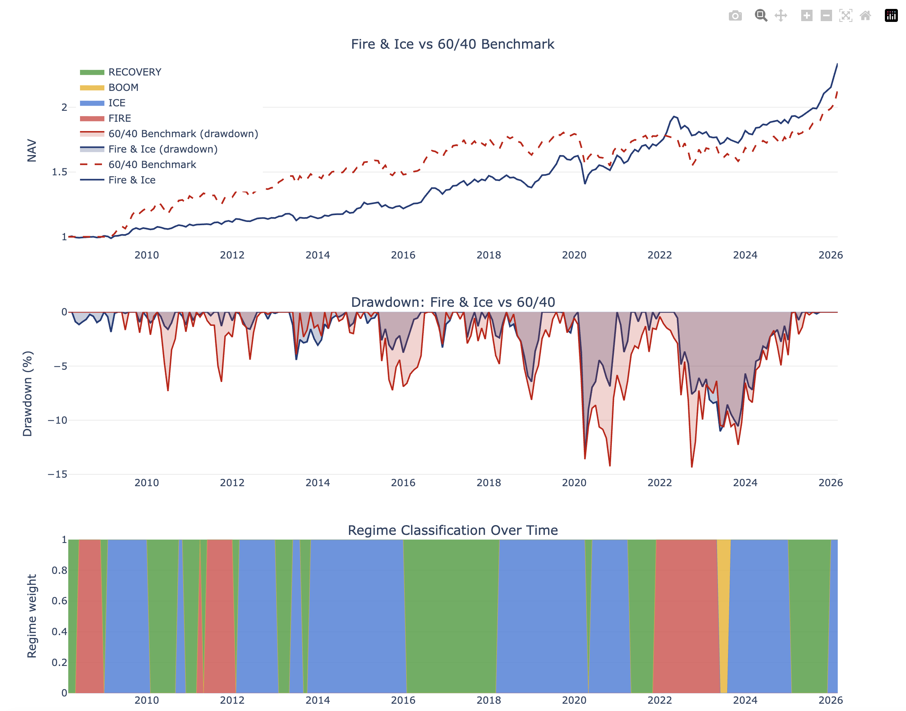

# Inflation Allocation (Fire & Ice)

Fire & Ice is a UK-focused tactical allocation model that reacts to inflation regimes instead of trying to forecast prices directly. It reads a small set of public macro time series (UK CPI and policy rates), classifies each month into one of four regimes (FIRE, ICE, BOOM, RECOVERY), and then applies simple, pre-set portfolio weights for each regime with an optional risk‑parity overlay. The goal is not to maximise backtest Sharpe at all costs, but to show how a transparent, rules-based process behaves through different macro environments.

## Results (sample backtest, 2005–2026)

| Metric | Fire & Ice | 60/40 Benchmark |
|--------|------------|-----------------|
| Ann. return | 4.82% | 1.17% |
| Ann. vol | 5.91% | 8.65% |
| Sharpe | 0.82 | 0.14 |
| Sortino | 1.07 | 0.21 |
| Calmar | 0.36 | 0.03 |
| Max drawdown | -13.45% | -39.70% |

Charts are written to `reports/backtest_charts.html` after running the backtest.



### Canonical v2 metrics

For the Fire & Ice v2 pipeline using data from 2005–2026 and the current configuration (217 months):

| Sample          | Ann. return | Ann. vol | Sharpe | Max drawdown | n months |
|-----------------|-------------|----------|--------|--------------|----------|
| Full history    | 4.82%       | 5.91%    | 0.82   | -13.45%      | 217      |
| 60/40 benchmark | 1.17%       | 8.65%    | 0.14   | -39.70%      | 217      |
| Ex-2008–2009    | 3.57%       | 5.94%    | 0.60   | -13.25%      | 211      |

Outside the 2008–2009 crisis window, the portfolio delivers a Sharpe ratio of about 0.6–0.8 with a maximum drawdown around -13%. The worst month still occurs during the 2008 financial crisis, when a late‑cycle commodity supercycle peak collided with a systemic credit shock, but the current configuration keeps that loss in line with the rest of the distribution.

### Performance by regime (2005–2026)

| Regime  | Ann. return | Ann. vol | Sharpe | Max drawdown | Months |
|--------|-------------|----------|--------|--------------|--------|
| RECOVERY | 9.13%     | 4.96%     | 1.84   | -3.29%       | 69     |
| ICE      | 3.34%     | 6.43%     | 0.52   | -13.45%      | 111    |
| FIRE     | 1.69%     | 5.57%     | 0.30   | -8.43%       | 34     |
| BOOM     | -1.07%    | 8.96%     | -0.12  | 0.00%        | 3      |

BOOM only has three months in this sample, so it should be treated as a footnote rather than a stable pattern. The regime counts are also skewed: ICE alone covers 111 months (about half the history), so the headline portfolio Sharpe leans heavily on how the model behaves in ICE rather than on a perfectly even split across FIRE, ICE, BOOM, and RECOVERY.

**Regime adaptations (transparency).** FIRE (High + Rising) uses a strategic allocation that tilts heavily to commodities and CTA and keeps duration/equities at 2% so inflation hedges are not diluted. ICE, BOOM, and RECOVERY use risk-parity where applicable (with blending). Weight method by regime: RECOVERY — 70 months (5 base, 65 blend); FIRE — 34 months (34 base); ICE — 111 months (1 base, 110 blend); BOOM — 3 months (3 blend).

### Data window and sources

The canonical v2 backtest uses monthly data from January 2005 through March 2026 (effective start follows `backtest.start_date` in `fire_ice_model_2/config.yaml`, with an additional warm-up period for z-score calculations). Asset prices are pulled via `yfinance` for:

- ISF.L, VMID.L, IGLT.L, INXG.L, IHYG.L, CMOD.L, IGLN.L, DBMF

UK CPI is fetched from the ONS CSV generator (`/economy/inflationandpriceindices/timeseries/d7bt/mm23`), and the BoE policy rate is taken from the configured FRED/BoE series. Raw monthly price and CPI histories are cached as Parquet files under `.cache/parquet/` (for example `asset_prices.parquet`, `uk_cpi.parquet`) so the same snapshot can be reused without re-downloading. The v2 CLI also saves an interactive Plotly dashboard to `reports/backtest_charts.html` with cumulative NAV vs a 60/40 benchmark (217 points) and a regime-conditional performance table.

All inputs are open-source public data. The project does not use any client data, vendor files, or Bloomberg (BBG) feeds, which keeps it easy to reproduce on a clean machine and avoids licensing issues for anyone reading the code.

## Research background and ethos

The design follows the regime framework described in Neville et al. (2021) and related macro-finance work on how equities, bonds, inflation-linked bonds, credit, commodities, and trend-following strategies behave under different inflation and growth states. Fire & Ice keeps that structure but pares it back to a small, ETF-based UK implementation so the link between the paper and the code is easy to trace.

Rather than searching for the “best” parameter set, the model fixes a small number of intuitive choices: a CPI-based regime classifier, a simple CTA sleeve built with time-series momentum, and a modest risk-parity blend outside FIRE. The emphasis is on clean data handling, clear logging of regime decisions and weights, and honest reporting of weak spots such as the 2008 episode, so that a reader can judge the idea on its merits rather than on aggressive backtest tuning.

## Discussion and limitations

In this implementation Fire & Ice delivers higher return and higher Sharpe than the 60/40 benchmark (4.82% vs 1.17% ann. return, Sharpe 0.82 vs 0.14), with lower volatility and a much smaller maximum drawdown (-13.45% vs -39.7%). If I had more time I would tune the regime definitions and trend signals, and experiment with extra assets or risk controls, to see whether the idea survives in a richer but still realistic setup.

The current configuration’s worst historical drawdown (about -13%) still occurs around the 2008 financial crisis, when a late‑cycle commodity supercycle peak collided with a systemic credit shock. The model’s monthly regime switch uses only level × direction of CPI and has no way to distinguish “inflationary commodity exposure” from “crisis‑driven commodity collapse” at that horizon, so it remains fully allocated to the FIRE commodity sleeve as the shock unfolds. This should be read as an honest limitation of a simple monthly macro regime model, not a failure of the implementation.

At a higher level the model makes three big simplifying assumptions:

- Regimes are detected only from monthly CPI data (year-on-year level and a simple acceleration proxy), with no intramonth macro or market information.
- The CTA sleeve uses a simple time-series momentum signal over a small ETF universe rather than a fully calibrated CTA index, so its hedge quality in crises is approximate rather than exact.
- Asset behaviour is assumed to be reasonably stable across history; regime definitions and weights were not backfit to specific recent episodes.

Deliberately, there is no grid search over thresholds or windows to optimise Sharpe, and the asset universe was not cherry-picked after seeing results. The design started from Neville-style regime logic and a literature-backed role for CTAs, then focused on data integrity (cleaning a gold split, handling DBMF inception) and transparent diagnostics rather than tweaking parameters to maximise backtest performance. In a production setting the main knobs you might tune are the z-score window, hysteresis, CTA universe, and risk-parity parameters, but those have been left at reasonable defaults here so the behaviour is easy to explain.

## Goals

- Classify inflation regimes (FIRE / BOOM / ICE / RECOVERY) from UK CPI.
- Backtest regime-conditional allocation vs a 60/40 benchmark.
- Report nominal and real wealth metrics, with BoE risk-free rate in Sharpe/Sortino.

## Structure

`fire_ice_model_2/` — main package.  
`fire_ice_model_2/data_ingestion/` — CPI (ONS), ETF prices via `yfinance`, BoE rate.  
`fire_ice_model_2/regime_engine/` — classifier, backtest, metrics.  
`fire_ice_model_2/allocation_logic/` — regime weights, risk parity.  
`fire_ice_model_2/trend_following/` — synthetic CTA (TSMOM).  
`fire_ice_model_2/analysis/` — Plotly charts (cumulative returns, weight heatmap).  
`fire_ice_model_2/tests/` — unit tests.  
`fire_ice_model_2/config.yaml` — regime, allocation, backtest, and data settings.

Cache and outputs live under `.cache/parquet/` for data and `reports/` for HTML charts; these are not committed.

## Environment and setup

This repo assumes Python 3.14 and uses a virtual environment under `fire_ice_model_2/.venv` for the v2 pipeline.

```bash
cd "/path/to/Inflation allocation"
cd fire_ice_model_2
python3 -m venv .venv
source .venv/bin/activate   # or .venv\Scripts\activate on Windows
cd ..
pip install -r requirements.txt
```

## Run (v2 pipeline)

Run from the **project root** (the directory that contains `fire_ice_model_2/`) using the full module path. Cache (`.cache/parquet/`) and reports (`reports/`) are resolved relative to the project root, so the benchmark and charts work regardless of your current working directory.

```bash
cd "/path/to/Inflation allocation"
python -m fire_ice_model_2.regime_engine.backtest_engine
```

Charts are written to `reports/backtest_charts.html` (open in a browser).

## Tests

With `pytest` (recommended):

```bash
pytest
```

To run only the v2 tests:

```bash
pytest fire_ice_model_2/tests
```

